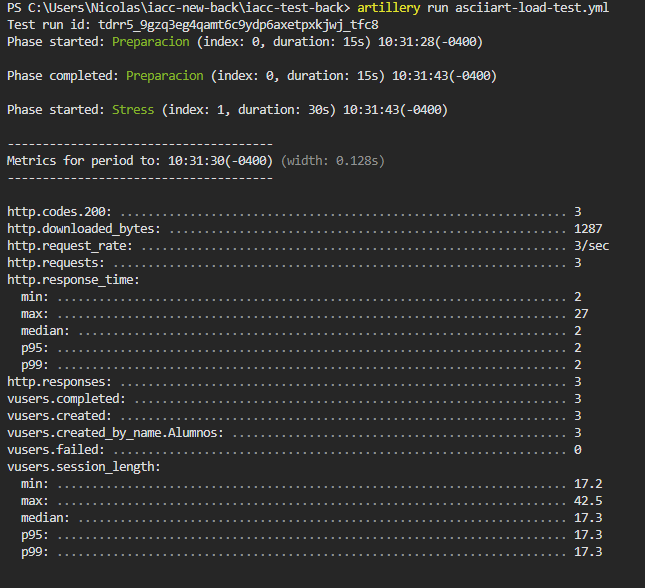
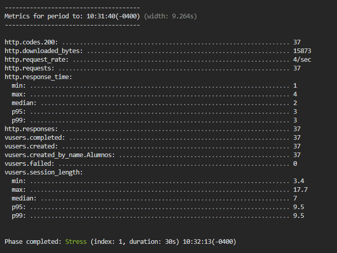
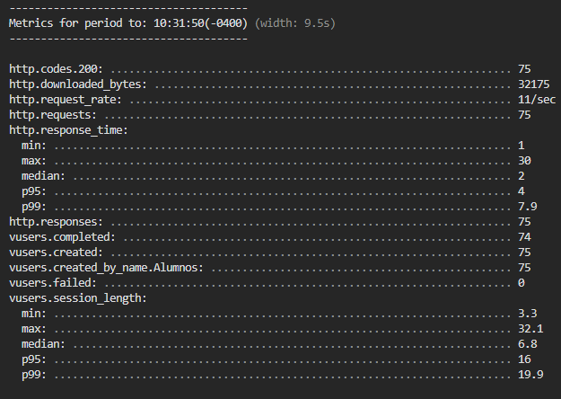
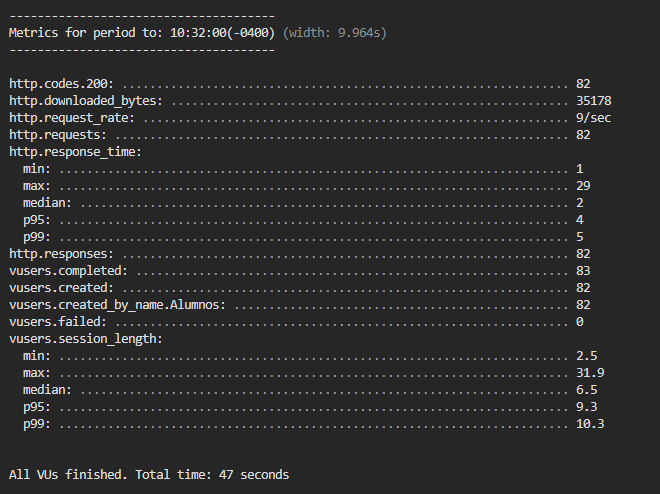
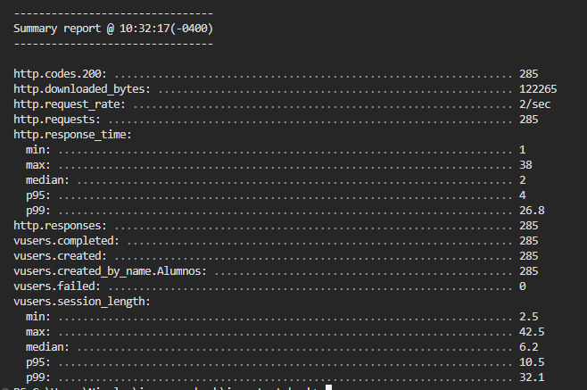

# People Change -Challenge-

## Instalación

Clona este repositorio: `git clone https://github.com/NicolasValdes27/iacc_test_back.git`

Instala las dependencias: `npm i`

Para ejecutar el proyecto: `npm run start:dev`

Se aloja en: `http://localhost:3050/`

## Pruebas de estrés (Stress testing)

Para lanzar el test de estrés se debe ejecutar el comando: `artillery run asciiart-load-test.yml`

  

  

  

  

  

## API's Cursos

Para crear un curso (POST): `http://localhost:{PORT}/cursos`. La estructura del cuerpo es la siguiente:
{
    "nombre": "string",
    "codigo": "string",
    "anyo": "string",
    "semestre": "string",
    "sede": "string"
}

Para obtener todos los cursos (GET): `http://localhost:{PORT}/cursos`

Para obtener un curso específico (GET): `http://localhost:{PORT}/cursos/:id`

Para actualizar un curso (PUT): `http://localhost:{PORT}/cursos/:id`. El cuerpo de la solicitud debe contener los campos que se desean actualizar.

Para eliminar un curso (DELETE): `http://localhost:{PORT}/cursos/:id`

Para enrolar un alumno a un curso (POST): `http://localhost:{PORT}/cursos/:id/alumnos`. La estructura del cuerpo es la siguiente:
{
    "alumnos": [id, id, id]
}

También dejo los siguientes comandos para utilizar en la terminal de Windows (CMD):

`curl -X POST http://localhost:{PORT}/cursos -H "Content-Type: application/json" -d "{\"nombre\": \"Fundamentos Mat\",\"codigo\": \"MAT-2702\",\"anyo\": \"2023\",\"semestre\": \"2\",\"sede\": \"Valparaiso\"}"`

`curl -X DELETE http://localhost:{PORT}/cursos/:id -H "Content-Type: application/json"`

`curl -X GET http://localhost:{PORT}/cursos/:id -H "Content-Type: application/json"`

`curl -X GET http://localhost:{PORT}/cursos -H "Content-Type: application/json"`

`curl -X PUT http://localhost:{PORT}/cursos/:id -H "Content-Type: application/json" -d "{\"nombre\": \"Fundamentos Mat v2\",\"codigo\": \"MAT-1111\",\"anyo\": \"2021\",\"semestre\": \"1\",\"sede\": \"Santiago\"}"`

`curl -X POST http://localhost:{PORT}/cursos/:id/alumnos -H "Content-Type: application/json" -d "{\"alumnos\": [1,2,3,4]}"`

## API's Alumnos

Para crear un alumno (POST): `http://localhost:{PORT}/alumnos`. La estructura del cuerpo es la siguiente:
{
    "nombre": "string",
    "apellido": "string",
    "email": "string",
    "edad": number,
    "direccion": "string"
}

Para obtener todos los alumnos (GET): `http://localhost:{PORT}/alumnos`

Para obtener un alumno específico (GET): `http://localhost:{PORT}/alumnos/:id`

Para actualizar un alumno (PUT): `http://localhost:{PORT}/alumnos/:id`. El cuerpo de la solicitud debe contener los campos que se desean actualizar.

Para eliminar un alumno (DELETE): `http://localhost:{PORT}/alumnos/:id`

También dejo los siguientes comandos para utilizar en la terminal de Windows (CMD):

`curl -X POST http://localhost:{PORT}/alumnos -H "Content-Type: application/json" -d "{\"nombre\": \"Nicolas\",\"apellido\": \"Valdes\",\"email\": \"correo@gmail.com\",\"edad\": 23,\"direccion\": \"Calle 123\"}"`

`curl -X DELETE http://localhost:{PORT}/alumnos/:id -H "Content-Type: application/json"`

`curl -X GET http://localhost:{PORT}/alumnos/:id -H "Content-Type: application/json"`

`curl -X GET http://localhost:{PORT}/alumnos -H "Content-Type: application/json"`

`curl -X PUT http://localhost:{PORT}/alumnos/:id -H "Content-Type: application/json" -d "{\"nombre\": \"Nico\",\"apellido\": \"Quinteros\",\"email\": \"correo2023@gmail.com\",\"edad\": 24,\"direccion\": \"Calle 999\"}"`